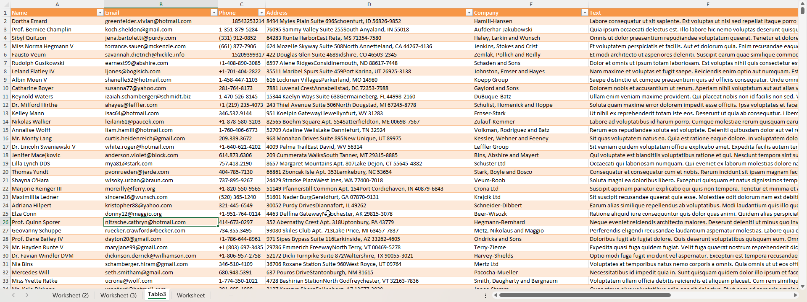
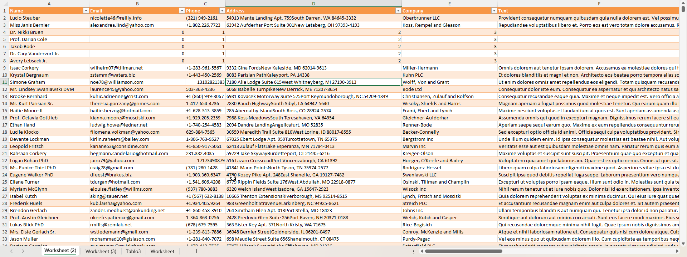

# excelsior
[](https://github.com/krakotay/excelsior/actions/workflows/rust.yml)
[](https://github.com/krakotay/excelsior/actions/workflows/release.yml)

[pypi link](https://pypi.org/project/excelsior-fast/)

A small project for quickly modifying `.xlsx` workbooks from Rust or Python.
It consists of two crates:

* **rust-core** – the core library that works directly with spreadsheet XML.
* **python-bindings** – Python wrapper built with `pyo3` and `maturin`.

The library lets you append rows or tables, modify individual cells and
save the workbook back to disk without loading the entire file into memory.

## Example
```python
from excelsior import Editor
import os
import polars as pl

base_dir = os.path.dirname(os.path.abspath(__file__))

editor = Editor(os.path.join(base_dir, "../../test/100mb.xlsx"), "Tablo3")
df = pl.DataFrame(
    {
        "int": [1, 2, 3] * 1000,
        "float": [1.1, 2.2, 3.3] * 1000,
        "string": ["a" * 100, "b" * 100, "c" * 100] * 1000,
    }
)
editor.with_polars(df) # THIS WILL NOT CHANGE FORMATTING OF EXISTING CELLS!
editor.save(os.path.join(base_dir, "100mb_excelsior_polars.xlsx"))

```


